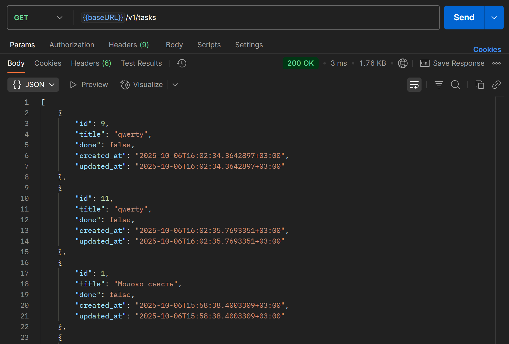
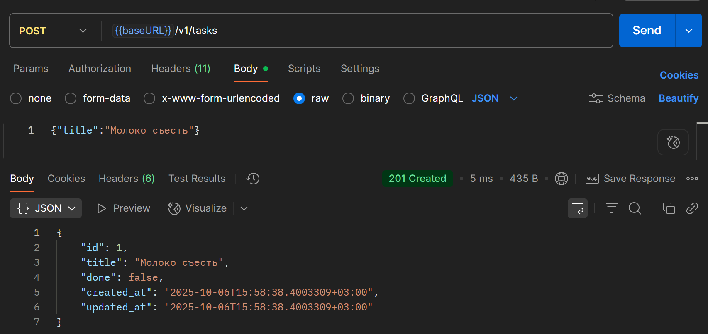
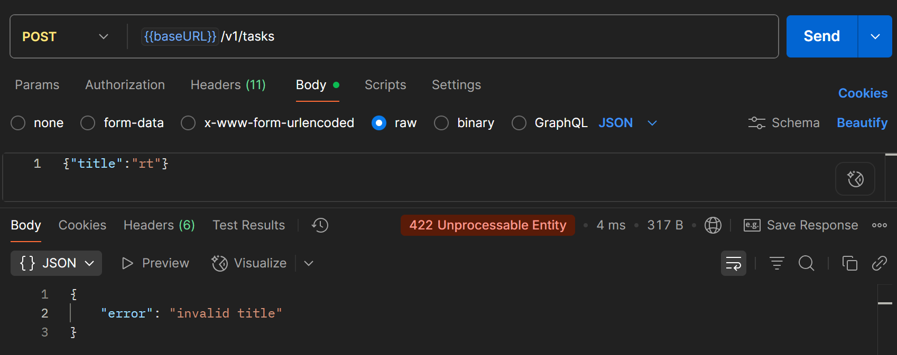
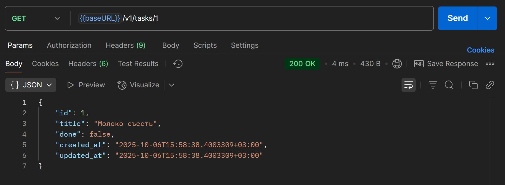
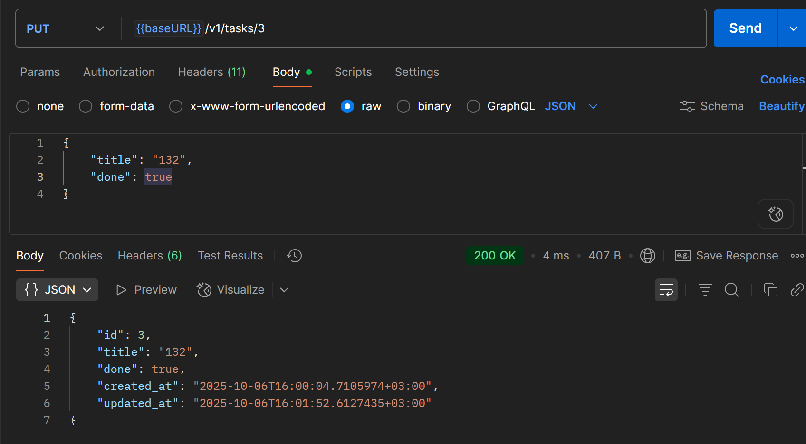
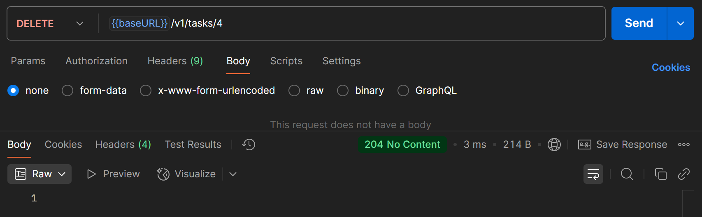
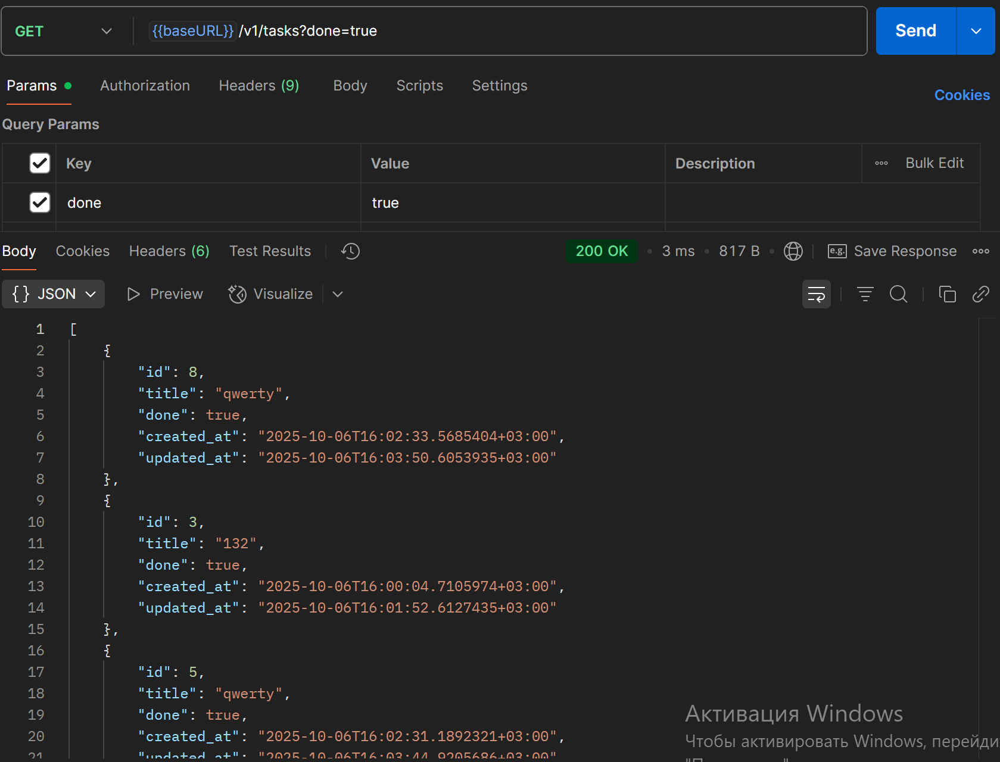
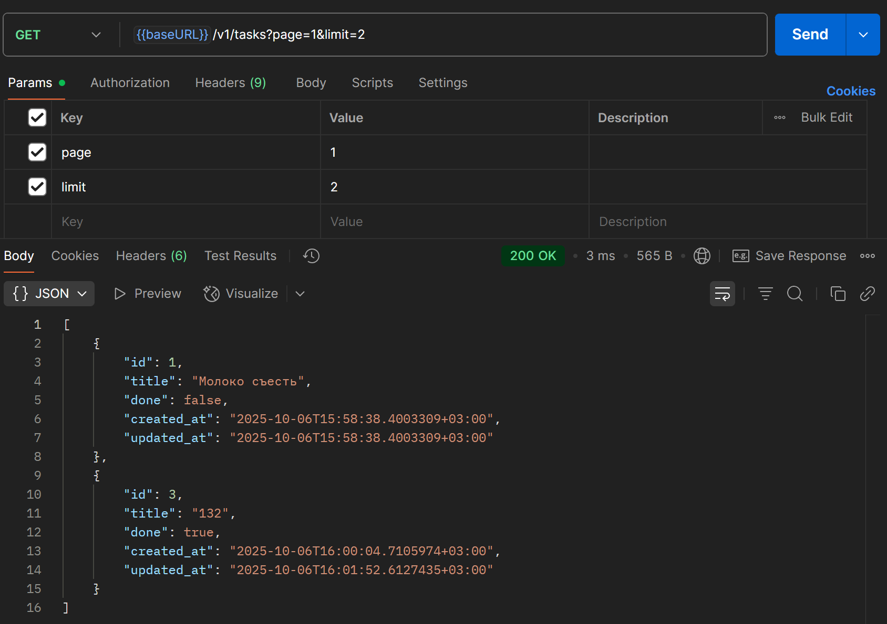

# Практическая работа #4
## Маршрутизация с chi (альтернатива — gorilla/mux). Создание небольшого CRUD-сервиса «Список задач».
## Выполнил: Туев Д. ЭФМО - 01

## Описание проекта
Данный проект предназначен для изучения основ построения web приложений на основе *chi* роутера.

## Цели:
1.	Освоить базовую маршрутизацию HTTP-запросов в Go на примере роутера chi.
2.	Научиться строить REST-маршруты и обрабатывать методы GET/POST/PUT/DELETE.
3.	Реализовать небольшой CRUD-сервис «ToDo» (без БД, хранение в памяти).
4.	Добавить простое middleware (логирование, CORS).
5.	Научиться тестировать API запросами через curl/Postman/HTTPie.

## Ход работы
### Структура проекта
```
pz4-todo/
├── cmd/
│   └── server/
│       └── main.go
├── internal/
│   └── task/
│       ├── handler.go
│       ├── model.go
│       └── repo.go
├── pkg/
│   └── middleware/
│       ├── cors.go
│       └── logger.go
├── go.mod
└── go.sum
```

# Для разработчика

## Запросы - ответы
Сервер поддерживает следующие [запросы](https://lively-flare-564043.postman.co/workspace/My-Workspace~fe2081e8-b325-4776-8b48-400d41f5b4bd/collection/42992055-41a9fb3c-2aa9-4e24-b8ce-07b1e3503fc8?action=share&source=copy-link&creator=42992055)
по эндпоинту /api/v1 (на данный момент сервер поддерживает версии api: v1 и v2):
- GET /health — возвращает {"status":"ok"}.
- GET /tasks — возвращает список задач, поддерживает фильтр ?page= &limit= , а также фильтр ?done=.
- POST /tasks — создаёт задачу по {"title":"..."}.
- GET /tasks/{id} — возвращает одну задачу.
- PUT /tasks/{id} — для изменения флага done на "true", в теле необходимо передать заголовок и статус задачи.
- DELETE /tasks/{id} — для удаления задачи из Repo по id, возвращает удаляемую задачу.

Структура запросов, а также их наполнение представлено в формате JSON в файле [Requests.md](pz4-todo/about/Requests.md)

## Проверка работоспоcобности
### Обработка ошибок и коды ответа

| Код | Название             | Где обрабатывается                         | Что значит / когда возвращается                                                                   |
|-----|----------------------|--------------------------------------------|---------------------------------------------------------------------------------------------------|
| 200 | OK                   | `list`, `get`, `update`                    | Успешный ответ с данными (список задач, одна задача или обновлённая задача).                      |
| 201 | Created              | `create`                                   | Новая задача успешно создана, в теле возвращается JSON с задачей.                                 |
| 204 | No Content           | `delete`                                   | Задача успешно удалена, тело ответа пустое.                                                       |
| 400 | Bad Request          | `parseID`, `create`, `update`, `list`      | Некорректные данные запроса: неверный ID, пустой или некорректный JSON, ошибка в query-параметре. |
| 404 | Not Found            | `get`, `update`, `delete`                  | Задача с указанным ID не найдена.                                                                 |
| 422 | Unprocessable Entity | `create`, `update` (через `validateTitle`) | Нарушена валидация данных (title короче 3 или длиннее 100 символов).                              |

### Примеры запросов
`GET /tasks` без параметров



`POST /tasks` успешная валидация



`POST /tasks` ошибка валидации



`GET /tasks/{id}` 



`PUT /tasks/{id}`



`DELETE /tasks/{id}`



`GET /tasks` с фильтром по done



`GET /tasks` с пагинацией



### Пример тестирования

| Маршрут                | Запрос (пример)                                | Ожидаемый ответ                    | Фактический ответ                             |
|------------------------|------------------------------------------------|------------------------------------|-----------------------------------------------|
| **POST /tasks**        | `{"title":"Задача 1"}`                         | 201 Created + JSON новой задачи    | 201, задача создана                           |
| **POST /tasks**        | `{"title":"3a"}`                               | 422 Unprocessable Entity           | 422, `{"error":"title must be 3..100 chars"}` |
| **GET /tasks**         | без параметров                                 | 200 OK + полный список задач       | 200, список JSON                              |
| **GET /tasks**         | `?done=true`                                   | 200 OK + список выполненных задач  | 200, JSON только с `done=true`                |
| **GET /tasks**         | `?page=1&limit=2`                              | 200 OK + первые 2 задачи           | 200, вернулись задачи 1 и 3                   |
| **GET /tasks/{id}**    | `/tasks/7`                                     | 200 OK + JSON задачи               | 200, вернулась задача id=7                    |
| **GET /tasks/{id}**    | `/tasks/999` (несуществующий)                  | 404 Not Found                      | 404, `{"error":"task not found"}`             |
| **PUT /tasks/{id}**    | `/tasks/7` + `{"title":"qwerty","done":true}`  | 200 OK + обновлённая задача        | 200, обновление прошло                        |
| **PUT /tasks/{id}**    | `/tasks/999` + `{"title":"Fail","done":true}`  | 404 Not Found                      | 404, `{"error":"task not found"}`             |
| **DELETE /tasks/{id}** | `/tasks/2`                                     | 204 No Content                     | 204, задача удалена                           |
| **DELETE /tasks/{id}** | `/tasks/999`                                   | 404 Not Found                      | 404, `{"error":"task not found"}`             |


### Выводы

В ходе работы был реализован HTTP-сервер на Go с использованием роутера **chi**.  
Были обработаны все основные маршруты CRUD для ресурса `tasks`: создание, чтение, обновление и удаление.  
Подключены и протестированы middleware для логирования и CORS.

Кроме обязательной части, были выполнены и дополнительные задания:

1. **Валидация длины title** — добавлена проверка, что название задачи не короче 3 и не длиннее 100 символов. При нарушении возвращается ошибка `422 Unprocessable Entity`.
2. **Пагинация списка** — реализованы параметры `page` и `limit` для запроса `/tasks`, позволяющие получать данные постранично.
3. **Фильтрация по done** — добавлен параметр `done=true/false`, чтобы выбирать только выполненные или только невыполненные задачи.
4. **Сохранение на диск** — при старте приложения данные читаются из файла [`tasks.json`](./tasks.json), а при изменениях (создание/обновление/удаление) автоматически сохраняются обратно. Однако такой способ лучше заменить на использование СУБД (например, PostgreSQL).
5. **Версионирование API** — все маршруты вынесены под префикс `/api/v1/...`, что позволит в будущем поддерживать несколько версий API параллельно.

Наиболее сложными моментами оказались реализация пагинации и сохранения данных на диск.  
Пагинация требовала обработки map, а сохранение — правильной синхронизации записи в файл при изменении данных.